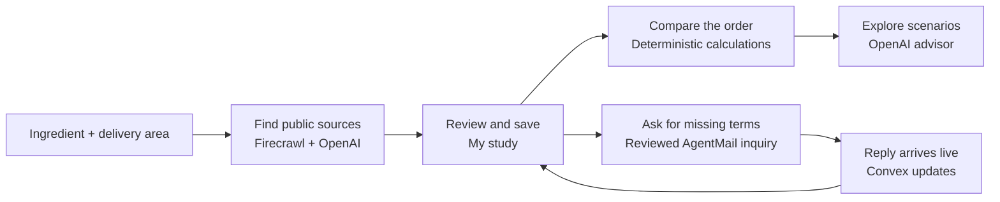

# Surtario

**Sourcing for your kitchen.** Find supplier options, keep the evidence and understand the full order before choosing an offer.

[Try Surtario](https://incredible-wolverine-122.convex.site) · [Hackathon build log](hackathon.md) · [Setup and configuration](docs/DEVELOPMENT.md)

Start with an ingredient and delivery area. You do not need recipes, purchase history, documents or an order quantity to research the market.

## How it works



Convex keeps the research, messages and saved decisions connected. AI proposes information; you review the evidence before it becomes an offer. An incoming email does not silently change a price, and choosing an offer does not place an order.

- **Overview:** resume related studies, follow-ups and conversations, review pending evidence and see saved decision changes. Update a saved study with one explicit live search; findings await review before changing confirmed offers.
- **Research:** public prices, supplier contacts and sources without published prices, with visible progress and saved follow-ups.
- **Keep the useful options:** original source, observation date, product specification and unresolved terms stay attached to your study.
- **Ask and review:** approve a supplier inquiry, receive replies in Messages, then review proposed fields before saving them.
- **Compare:** whole packs, minimum orders, delivery, tax treatment, excess inventory and total cash required. Missing terms remain pending.

## Stack

| Technology | What it does |
| --- | --- |
| React, TypeScript, Vite | Workspace, source review and purchase comparison |
| Convex | Reactive data, server actions, durable workflows and static hosting |
| OpenAI | Cited extraction, research planning, inquiry suggestions and advice using calculation/evidence tools |
| Firecrawl | Public web discovery and page reading |
| AgentMail | Approved inquiry delivery and correlated replies |

The app registers the Convex Agent, Workflow and Static Hosting components. [Architecture and data boundaries](docs/ARCHITECTURE.md).

## Run locally

Requires **Node.js 22.12+** and npm.

```sh
npm ci
npm run dev:backend
```

Choose an anonymous local Convex backend for isolated development. Keep it running, then start the frontend in another terminal:

```sh
npm run dev
```

Open the Vite URL, normally `http://127.0.0.1:5173`. The Convex CLI supplies the public backend URL in `.env.local`; see [.env.example](.env.example). Without a backend, sample exploration and calculations work, but saving is unavailable.

Live services require server-side credentials and explicit feature gates. They are disabled when unconfigured. See [provider setup, local mail and deployment](docs/DEVELOPMENT.md).

## Verify

```sh
npm test
npm run check:hosting
```

These run domain/backend tests with simulated providers and check TypeScript, the production build and hosted assets. Browser tests need an isolated local backend; instructions are in [DEVELOPMENT](docs/DEVELOPMENT.md#browser-tests).

A bounded hosted journey on September 20 exercised real Firecrawl, direct OpenAI API, AgentMail test inboxes and Convex updates. Search, reviewed replies, calculation, advisor tools and recovery passed. [Executed evidence and limits](docs/VERIFICATION.md).

## Current boundaries

The hosted app uses isolated anonymous sessions and restricts outgoing email to a configured test recipient. Public sources can be incomplete: location in a search is not proof of delivery, and different specifications are not automatically equivalent. Private restaurant accounts, automatic purchases, recipes and a customer-data pilot are outside this release. The interface is English-first; each study keeps its currency and units explicit.

## Repository guide

- `src/` — interface, shared controls and deterministic domain rules.
- `convex/` — schema, reactive functions, integrations and workflows.
- `tests/`, `fixtures/` — browser coverage and synthetic test inputs.
- `scripts/` — verification, development mail and optional local rehearsal tools.
- `docs/` — [development](docs/DEVELOPMENT.md), [architecture](docs/ARCHITECTURE.md), [design](docs/DESIGN.md), [verification](docs/VERIFICATION.md) and [delivery status](docs/STATUS.md).
- `hackathon.md` — dated public build history using the [official Convex format](https://github.com/get-convex/convex-hackathon-skill).
