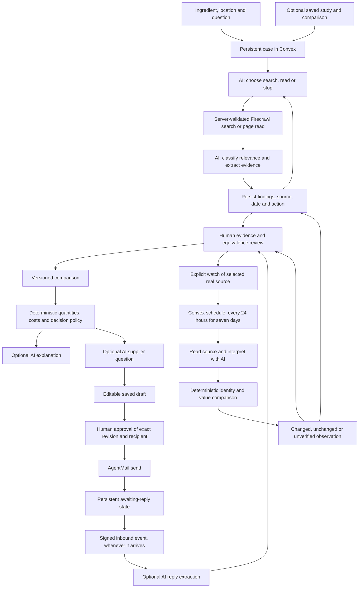

# Persistent sourcing cases

Implemented locally on September 14, 2026, in `codex/living-sourcing-cases`, based on `40af5ac`. The hackathon extension allows this workflow: research can continue from its own findings, supplier conversations remain traceable across long waits, and selected sources can be revisited. It does not establish real-provider or hosted acceptance.

## Architecture and AI boundaries

The AI now participates in research planning, source interpretation, optional inquiry drafting, optional reply interpretation and the existing advisor explanation. It cannot grant permissions, choose email recipients, confirm equivalence, replace confirmed commercial conditions or record purchases. Calculations and the decision policy remain deterministic.

`@convex-dev/workflow` 0.4.7 runs the durable research sequence. `sourcingCases`, `sourcingEvents` and `sourceWatches` store operational state separately from studies, research artifacts, comparison revisions and quotation requests. The interface recovers a case without needing documents, quantities, recipes or selected offers. A saved study can be attached later; a case's linked comparison is updated in place.

## Case workspace

The case now leads with a next step derived from saved facts: review a supplier reply, check an uncertain send, review a draft, review new evidence, wait for research or the supplier, inspect an unverified observation, or open the comparison. Research completion is never labeled as purchase readiness. Research, conversations and watch activity remain separately visible so a background process cannot hide a human decision.

Linked conversations open inside the case, directly on the selected request, with the existing message approval and reply-review controls. A later incoming reply updates the case without reloading. Human-reviewed reply evidence can return to the existing case comparison after the same explicit equivalence check. Reviewed reply IDs in saved comparison evidence remove that review prompt. Unreviewed research sources remain actionable; the UI does not mark them confirmed merely because extraction succeeded.

The creation form and case library collapse when a case opens. The current question, next step and evidence take precedence, with keyboard-accessible navigation to history, sources and conversations. Loading and offline states do not present absent data as completed work. The research-run limit is also explained when exhausted. The interface retains Surtario's existing English product language and shared brand tokens.

A catalog purchase started from a linked saved study resolves that study's case even when the case panel is closed. The initial comparison save carries the case ID; later study visits open its existing comparison with the saved quantity. This does not automatically assign older unlinked comparisons. The watch section explains ineligible sample/contact sources instead of leaving an unexplained empty area.

## Research contract

- Up to three explicit runs per case, each with at most three planning steps. Each step may search, read one discovered link or stop. Search results are deduplicated; at most three new sources are interpreted per step.
- The planner receives the objective, recent action history, candidate links, selected saved-study evidence, the linked comparison and its current advisor analysis. It can refine a search or stop after sufficient evidence; limits prevent repeating a query or following arbitrary model-generated URLs.
- Every model response is schema-validated. External actions have bounded timeouts and no automatic model/workflow action retry. Cancellation advances the case revision; late results cannot change canceled or superseded state. A provider request already in flight can still finish and consume its request budget.
- Ten cases per anonymous demo session, 500 total cases, the nine most recent research artifacts linked in the case view (earlier persisted artifacts remain stored). The timeline displays the latest 100 events. This is the existing isolated capability-token demo, not restaurant accounts or a private-data pilot.
- A failed run retains earlier evidence. Completing research means the run stopped; it does not mean an offer is confirmed or a purchase is ready.

## Supplier conversations

Creating a quotation records a draft event. Optional AI drafting is one attempt per quotation; it proposes only subject/body, with editable human review. Saving an edit advances the revision and clears the UI's previous approval. The server reserves the exact approved revision before sending. Interrupted generation expires after 90 seconds so manual editing is available again; late generated content is discarded.

Approval, send outcome, uncertain result, linked reply and confirmed reply review are idempotent case events. A draft can be traced through a linked study, comparison or prospect originating in the case. AgentMail retains its existing recipient allowlist, signature verification, threading and uncertain-send recovery. The app does not poll waiting for a reply in a minute: the request persists and the webhook can update it later. There is no automatic reminder, negotiation or repeated outbound message.

A reviewed new web offer can return to the same saved comparison after explicit equivalence review. The previous source snapshot stays in history; replacing an active offer clears its selection. The existing demo limit of four source records per comparison includes historical evidence; further additions are rejected explicitly. Quantity is preserved, unresolved terms remain pending, and another comparison revision requires a fresh calculation/advisor analysis. Comparison saves, confirmed replies and advisor decisions enter the case timeline.

## Selected-source monitoring

The user chooses up to three **real, selected, human-reviewed web sources** from an attached study. Synthetic examples and arbitrary URLs cannot be watched. The baseline is the reviewed supplier/product/specification/currency and price/package values.

A cron dispatcher runs every 15 minutes and claims due watches. Each watch is checked about every 24 hours for seven days, with at most seven attempts. Its claimed revision, lease, next check and expiry are persistent. Stopping a watch prevents pending actions from starting and rejects late results. An expired execution lease becomes an unverified observation, without inventing a price change.

AI interprets the page; deterministic code then requires the same product identity, specification and currency and usable positive price/package values. The result is:

- **Unchanged:** comparable canonical values match the last observation.
- **Changed:** comparable price/package values differ. A dated research artifact and review proposal are saved; the original baseline and confirmed comparison are preserved.
- **Unverified:** the page failed, changed identity, lacks usable values or could not be interpreted. This is never presented as a commercial change.

Monitoring currently detects **price and package changes**, not every possible freight, tax, stock or delivery change. Updates appear reactively in the case; browser push, email alerts and global market surveillance are not implemented. Reviewing a proposal does not automatically confirm its conditions.

## Configuration

All names below belong only in the Convex backend environment; absence leaves external capabilities disabled. This implementation did not enable them on a cloud deployment.

| Capability | Additional flag | Prerequisites |
| --- | --- | --- |
| Research self-loop | `SOURCING_ENABLED=true` | `LIVE_RESEARCH_ENABLED=true`, Firecrawl key, OpenAI key and extraction model |
| Selected-source watches | `SOURCE_WATCH_ENABLED=true` | Research self-loop prerequisites |
| Suggested supplier inquiry | `QUOTATION_DRAFT_ENABLED=true` | OpenAI key and extraction model |
| Reply interpretation | Existing `REPLY_EXTRACTION_ENABLED=true` | Existing reply extraction requirements |
| Advisor explanation | Existing `ADVISOR_ENABLED=true` | Existing advisor model and key |
| Actual test mail | Existing `AGENTMAIL_ENABLED=true` | Approved test recipient, inbox, signing secret and provider key |

Deploying this change requires both the schema/functions and the registered workflow component, followed by the frontend. The existing deployment-target guard and [provider acceptance procedure](CREDENTIALS_AND_E2E.md) apply. No new provider credentials are needed merely to create and recover cases or manually review evidence.

## Verification and remaining work

Local unit/backend tests cover the actual workflow component with mocked provider HTTP, stop decisions, cancellation, duplicate events, session isolation, watch registration and observations, immutable approval, draft interruption, case linking and revision-safe evidence updates. Browser coverage includes case recovery, isolation, offline controls, mobile/desktop reflow and the reviewed-evidence return to a saved comparison. Final counts are recorded in `ETAPAS.md` and `hackathon.md`.

This work does not claim real OpenAI API quality, a seven-day live watch, an external supplier response or hosted acceptance. Existing provider acceptance remains pending. The full hackathon path can be exercised locally with synthetic fixtures; production/private-data enablement remains a separate gate.

Deferred: continuous global discovery, multi-ingredient optimization, learned business preferences, autonomous supplier negotiation, automatic follow-up mail, account-based background notifications, private documents and restaurant accounts. These are product extensions, not dependencies for the implemented case loop.

### Progressive disclosure in the case

The case highlights one fact-derived next action. Conversations and selected-source watches expand on demand. A latest-event preview opens a focus-managed history dialog; short dated milestones expose the original event text through “View details”. Unknown event types retain their original summary. Message approval and evidence review continue in their existing flows, without nesting them inside the history dialog.

## Partial supplier answers: delivery cost

From a linked request, “Use reply to confirm delivery” opens a review of the original reply. The operator chooses an offer with unknown freight, enters the per-order amount in that offer's currency/tax basis, copies the exact evidence and confirms. Comparison views require saved changes and valid preferences; case/study views use the latest saved advisor preferences, or the default when no analysis exists.

`quotationMail.confirmReplyDelivery` validates session ownership, request/reply/case linkage, comparison revision, amount and verbatim evidence. It changes only freight, marks the source edited while preserving its original, clears the selected offer and stores immutable before/after reports in `deliveryConfirmations`. Exact retries reuse the event; conflicting retries, stale revisions and overwriting confirmed freight are refused. The evidence query is scoped to the comparison owner. History labels reports with their confirmation date/revision; they are historical results, not fresh recommendations after later edits.

This is explicit human interpretation, not AI extraction or automatic supplier negotiation. Unknown tax, equivalence and other terms remain pending. A confirmation response arriving after a local edit does not replace that newer draft. The confirmation dialog and persisted reply history connect back to the existing comparison; no duplicate purchase or automatic order is created.
